# Live Moderator Application

This project contains code which was used at the CeBIT 2017 for the **Innovation and Speed Challenge**.
The Objective of the **Innovation and Speed Challenge** was to build a **live moderator app**.

We defined what **Live Moderator App** could be, by following a _short_ design thinking process.

For more details, please take a look into the pdf inside the documentation.
[Link to the PDF](docs/day-1-LiveModerator@IBM_CeBIT_17_Innovation_Speed_Challenge.pdf)

***

## Basic Application Background

This app has the objective to allow a **visitor** to be **as close as possible to** a _demo point team_ on a trade fair.
The visitor can use Twitter or directly the "demo point website", sending message or requests etc. directly to the **demo point team**.

**The "Need Statement" for a trade fair visitor looks like this:**

_A visitor_ **needs a way** _to stay up date with a concrete Demo Point,_ **so that** _he can get the maximum information he needs to take advantage to optimize his future work._

The visitor can submit wishes, feedback and so on, using twitter or directly from the demo point website.

On the website everyone can see the actual feedback or comments from twitter or from the direct input.
This messages will be analyzed by the Watson services **Natural Language Understanding** and **Tone Analyzer**.
The sentiment result will be shown on the demo-point WebApplication in the color **green** for _positive_ statements and **red** for _negative_ messages.

To provide the ability to get in contact with the demo team there are two ways:

-	a) Using the chat bot on the web page
-	b) Get in contact with the team directly in a slack team.

To provide a fast response in the _slack team_.
The same chat-bot configuration, will observe the _slack team channel_ which is configured by using the Watson conversation service.

The following image contains the basic UseCases we identified for our **Live Moderator Application**.
In addition we also added a **Slack Bot integration** for a potential **slack teaming** with the demo-point-team.


***

## Basic Application Architecture

Why did we choose two different servers for our application?

As the easy **backend integration** we decided to use Node-RED, because of the **rapid prototyping capabilities**, easily to integrate Bluemix services or other APSs like Twitter, Slack and so on.

The Node.JS is used to run the Angular WebApplication. Here we had an existing basic self-developed framework we used to build the web application.

In the following image you can see in **blue** the _Bluemix Cloud Foundry Applications-Runtimes_ and in **brown** the used _Bluemix Services_ and their dependencies.

**Runtimes:**

* Node.JS with Node-RED (Backend)
* Node.JS (Fontend)

**Bluemix Services:**

* Conversation
* Cloudant
* Tone Analyzer
* Weather Insights
* Alchemy Language Service (**natural language understanding**)

**Social Integrations**

* Twitter
* Slack Bot

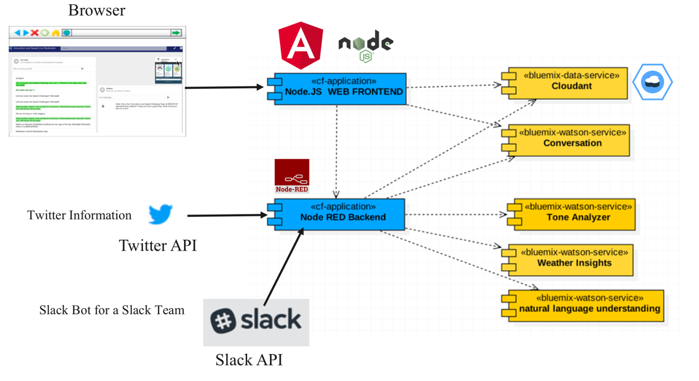

## Information about instructions: "How to run your own instance of this app in your Bluemix environment?"

The instructions to setup the **Live Moderator Application** is tailored for a _guided hands-on_ usage and **NOT** for self learning. It contains following main sections:

1. Setup and Configure Node-RED (Backend) and the related services
2. Setup and Configure Node JS Web Application (Frontend) and the related services
3. Add continuous delivery (devops) to the project

***

# 1. Setup and Configure Node-RED (Backend) and the related services

In the next chapters you will setup the Bluemix Services and the related social integrations.

**Bluemix Services:**

* Conversation
* Cloudant
* Tone Analyzer
* Weather Insights
* Alchemy Language Service (**natural language understanding**)

**Social Integrations**

* Twitter
* Slack Bot

***

## **1.1 Clone the github Project**

Clone the app to your local environment from your terminal using the following command
```
    git clone https://github.com/thomassuedbroecker/hands-on-live-moderator.git
```
***

## **1.2 Create Node-RED Server**

### **Step: 1**

Create Node-RED Server using the Node-RED starter on Bluemix https://console.ng.bluemix.net/catalog/starters/node-red-starter?taxonomyNavigation=apps
and name it like this **[APPLICATION_NAME]-[DETAIL-INFORMATION]** Sample: **handson-live-moderator-node-red**.

This will create a Node.JS  Server which contains the Node RED and creates a Instance of Cloudant service.

***

## **1.3 Configure the Node-RED flows**

### **Step: 1**

Follow the given steps when starting your Node-RED server.
At the end you should see following message:

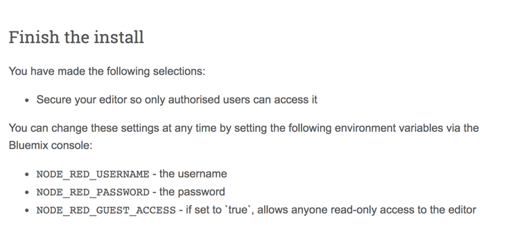

### **Step: 2**

Copy the _code_ from the *./nodered_flows/Flow-nodeRED.json* file and paste the _code_ into the running Node-RED instance.

If you copy the _code_ from the *./nodered_flows/Flow-nodeRED-V2.json* file and paste the _code_ into the running Node-RED instance, the task to replace the **Alchemy Service** is already done.

### **Step: 3**

Verify the given flows and the used services/integrations.

_Social Integrations:_
* Twitter (API)
* Slack (API)

_Bluemix Services:_   
* Cloudant
* Tone Analyser
* Weather Insights
* Alchemy Language Service (in this context the service is replaced by **natural language understanding**)

_Note:_ [Information about the replacement of the Alchemy Language Service](https://www.ibm.com/blogs/bluemix/2017/03/bye-bye-alchemyapi/)

***

## **1.4 Create the related Bluemix Services**

### **Step 1:**

Create the following services and bind them to the node-red-server-application.

* Tone Analyzer
* Weather Insights
* Alchemy Language Service (in this context the service is replaced by **natural language understanding**)

After you added the services restage the Node-RED server-application.

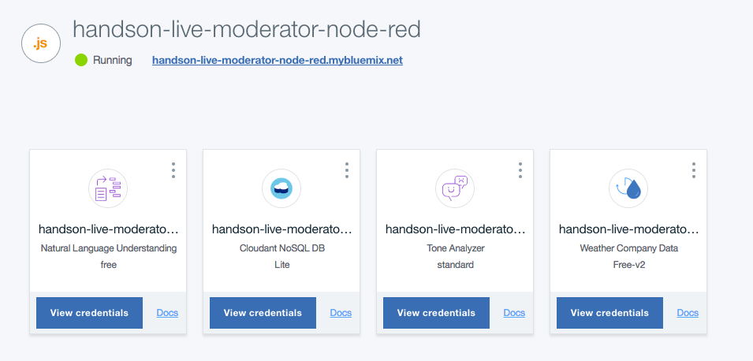

_Note:_ You should use a prefix for the naming of your service. Maybe it looks like this **[APPLICATION_NAME]-[SERVICE-INFORMATION]** Sample: **handson-live-moderator-tone-analyzer**.

***

## **1.5 Configure the existing Cloudant Service**

Add a additional database called **twitter_db** to the existing Cloudant service.

### **Step 1:**

Select the bound Cloudant service


### **Step 2:**

Open the Cloudant service

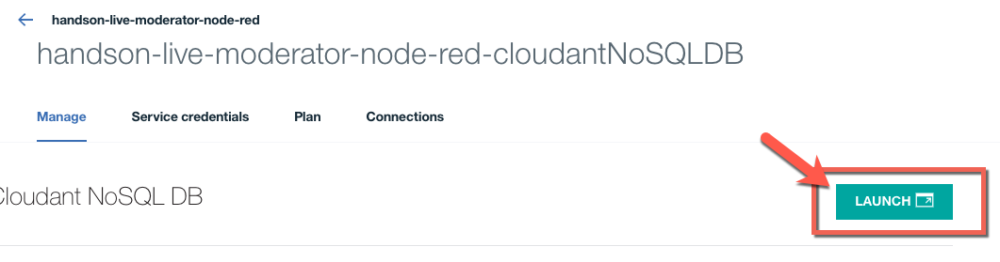

### **Step 3:**

Create a Cloudant database called **twitter_db**

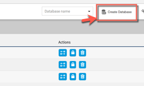

### **Step 4:**

Later for our web application, we need to get data directly from the Cloudant database.
To allow this communication, we must enable **CORS** in the Cloudant service.

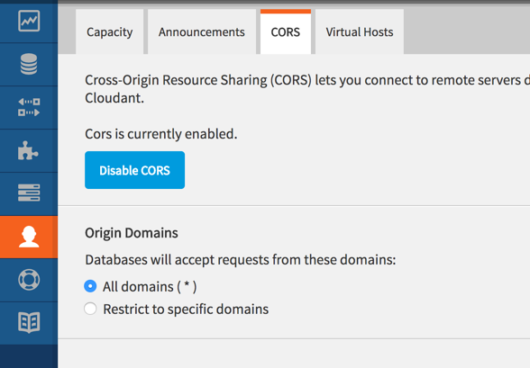

***

## **1.6 Add the a node-red extention to the node-red application**

Out of the box the node-red application configuration does not contain all available nodes for Node-RED.
In our case we need in addition the **slackbot integration** nodes.

### **Step 1:**

Now open **manage palette** in the Node-RED editor.

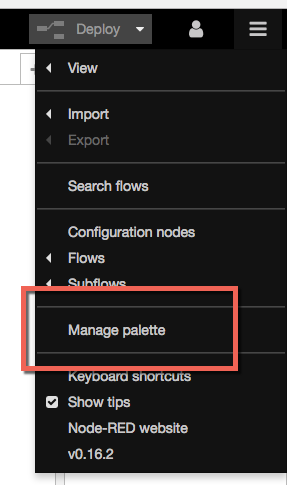

### **Step 2:**

Search for **Slack Bot** and install **node-red-contrib-slack**.

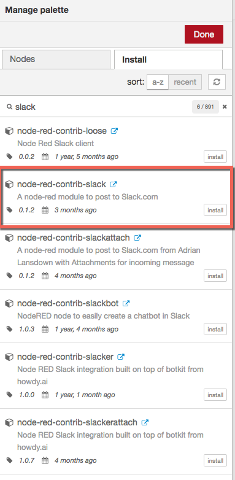

### **Step 3:**

Now you should find the slack-nodes in the social integration section.
[Documentation link] (https://www.npmjs.com/package/node-red-contrib-slack)

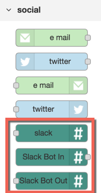

### **Step 4:**

Replace the **unknown nodes** for the social **slack integration**.

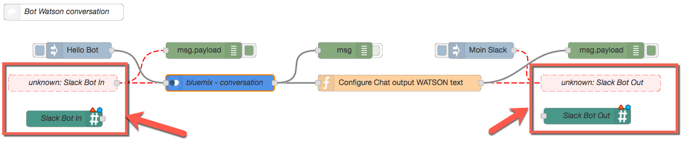

***

## **1.7 Replace existing node in the Node-RED-flow and configure the node**

The Alchemy Language Service is replaced by the **natural language understanding** service.

_Note:_ [Information about the replacement of the Alchemy Language Service](https://www.ibm.com/blogs/bluemix/2017/03/bye-bye-alchemyapi/)

### **Step 1:**

Replace the Alchemy Node with the *Natural Language Understanding* node.

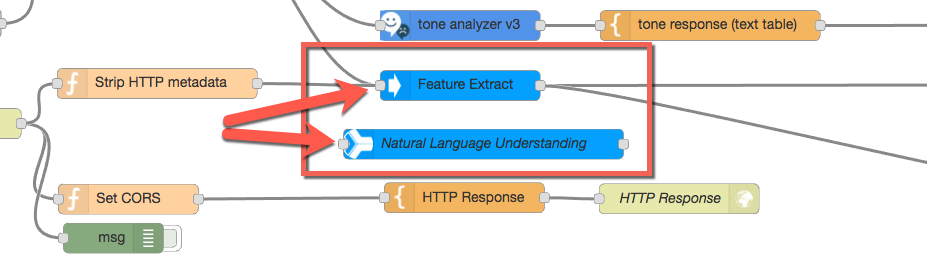

### **Step 2:**

Configure the new node.

Select in the "Natural Language Understanding configuration"

* Document Emotion
* Document Sentiment
* Entities (all)
* Keywords (all)

_NOTE:_ Maybe you have to restage the Node-RED application to notify the CF application to update the VCAP_SERVICES or your insert the USER and PASSWORD manually.

**Alchemy configuration**

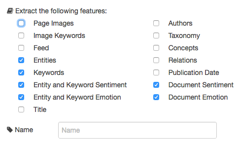

**Natural Language Understanding configuration**

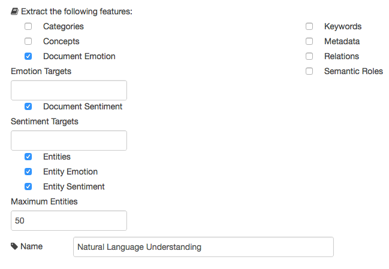

***

## **1.8 Your first test of the Node-RED flow**

Test some existing services in the node the Node-RED flow.

### **Step 1:**

With the node **Set testing Text** you send a predefined text to the Tone Analyzer and Natural Language Understanding services.

By switching on the related debug node, you can verify the output in the debug window on the right hand side.

* Tone Analyzer

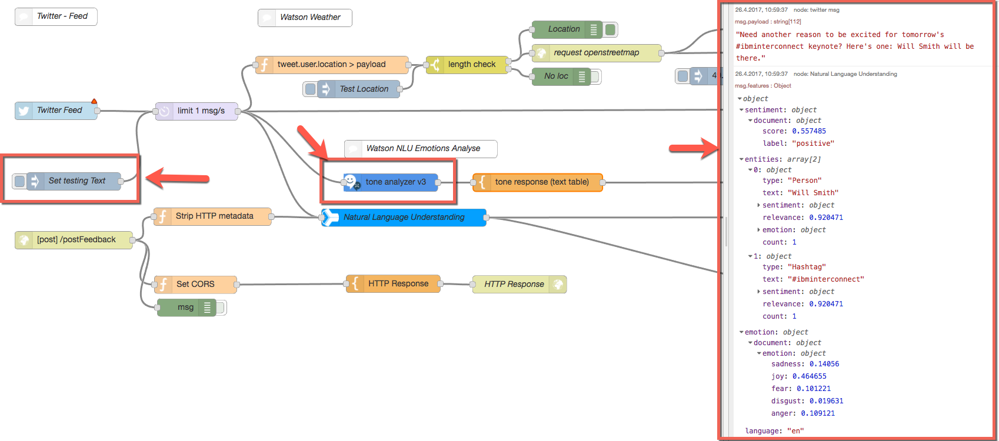

* Natural Language Understanding

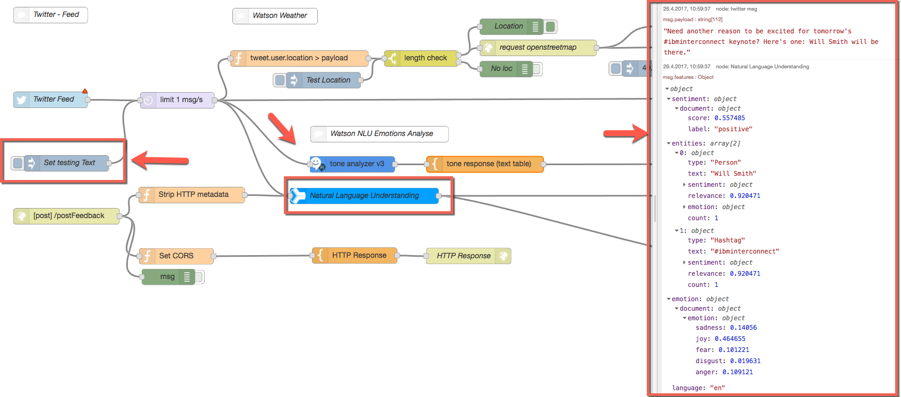

***

## **1.9 Configure and test the social twitter integration**

### **Step 1:**

When you open the twitter node you can insert your twitter credentials.
You will be asked by twitter: _Do you want to allow the Node-RED application the integration to your twitter account?_


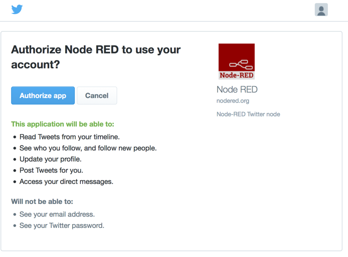

### **Step 2:**

The social integration with twitter and the result of the Watson services.
Now you can create your own tweet and verify the analyzed text in the Node-RED flow.

* Your sample tweet Message

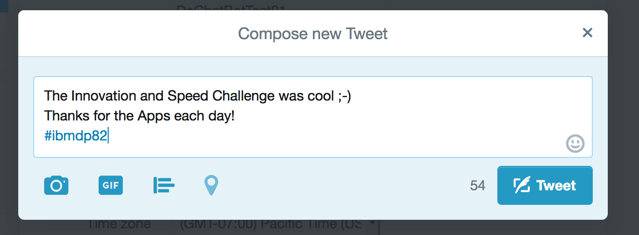

* The result inside the node-red flow

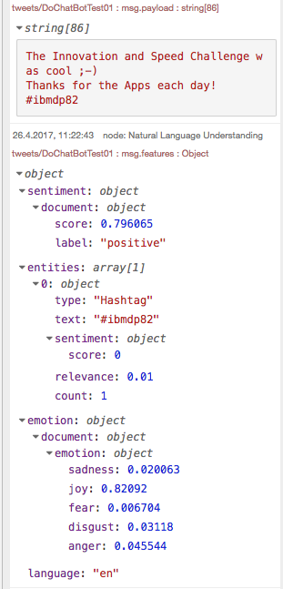

***

## **1.10 Configure and test the Slack Bot integration**

Inside the Slack Team we will use a Slack Bot to answer questions, using the Conversation service.

### **Step 1:**

Use this URL https://[YOUR_SLACKCHANNEL].slack.com/apps/manage/custom-integrations
then you should have the ability to select a **Slack Bot** integration and verify the abilities.

To add the integration to your Slack Team you must add the Slack Bot configuration to your Slack Team.

### **Step 2:**

Slack integration

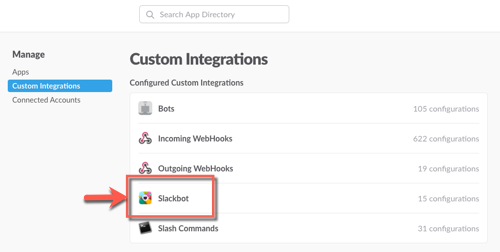

### **Step 3:**

Search for Slack Bot and add configuration

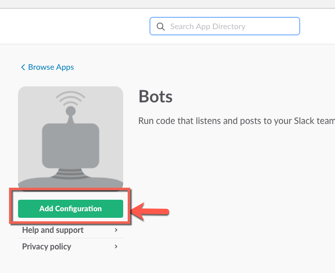

### **Step 4:**

Add the Slack Bot api integration

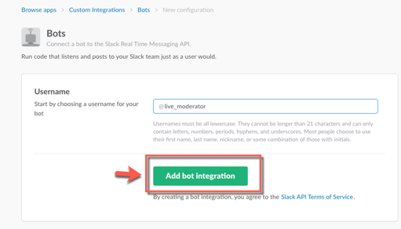

### **Step 5:**

Get the API key and insert the Key in the given **slack nodes** in the **Slack Bot** tab.


### **Step 6:**

Verify your Slack Bot is now active.

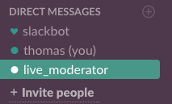

***

## **1.10 Create and configure the Conversation service**

### **Step 1:**

* Create an **unbound** Conversation service in your Bluemix space.
* Launch the **conversation service tool**.
* Select import, when **create workspace** appears and select the file **./conversion/live_moderator_conversation_workspace.json** for the import.

### **Step 2:**

Get the **workspace_id** and **user/password** for the Conversation node inside the Node-RED editor.
After this you can chat with the **Slack Bot** using the Conversation service.

***

## 1.11 Test the conversation service

Chat with the Slack Bot using the conversation service.

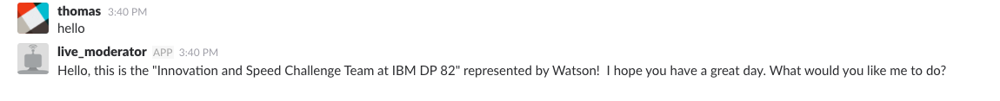

***

#2. Setup and Configure Node JS Web Application (Frontend) and the related services

In the next steps you will setup and configure Node JS Web Application (Frontend) and the related services.

***

## 2.1 Create the CF Node.JS  Application Frontend

Create a CF Node.JS Application and name it like **handson-live-moderator-frontend**.

***

## 2.2 Customize the code to the Frontend WebApplication and the Frontend Server

The code contains some hard coded authorizations and URLs which must be tailored to your application in Bluemix.

### **Step 1:**

Open the file **./public/js/factory/factoryFeedSocket.js** .

The change in the file will effect the **web application**, which is running on the Node.JS server.
Inside the code you have to change the URL to your **existing Node-RED application** route "wss://**[YOUR_BLUEMIX_ROUTE]**.mybluemix.net/livefeed" information.

```javascript
    function wsConnect() {
      ws = new WebSocket("wss://[YOUR_BLUEMIX_ROUTE].mybluemix.net/livefeed");
      ws.onmessage = function (message) {
        handleData(JSON.parse(message.data));
      };
      ws.onclose = function () {
        setTimeout(wsConnect, 1000);
      };
    }
```

This code change is related to the **web socket** inside the Node-RED server:


### **Step 2**

This code is related to the Node-RED server using the **REST API** to get feedback to store inside the Cloudant **twitter_db**.

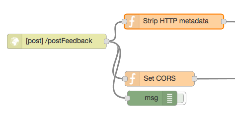

Open the file **./public/js/directive/directiveFeed.js**.
Inside the code you have to change the URL to your **existing Node-RED application** route "wss://**[YOUR_BLUEMIX_ROUTE]**.mybluemix.net/postFeedback" information.


```javascript
    $scope.postFeedback = function () {
      if (typeof $scope.feedback === 'string'
        && $scope.feedback.trim().length > 0) {
        var feedback = $scope.feedback.trim();
        $scope.spinnerWidget = "query";
        $http({
          url: 'https://[YOUR_BLUEMIX_ROUTE].mybluemix.net/postFeedback',
          method: 'POST',
          headers: {
            "Content-Type": "text/plain"
          },
          data: feedback
        }).then(function () {
          $scope.spinnerWidget = "";
          $mdToast.showSimple("Your feedback is appreciated!");
          $scope.feedback = '';
        }).catch(function (err) {
          $scope.spinnerWidget = "";
          console.log(err);
        });
      }
    };
```

### **Step 3:**

That change will effect the **Node JS Server**, here is a direct integration to the **Conversation service** which we created **unbound**.
Open the Node.JS Server file **./app.js** in the root folder and do the changes given in the code sample.

**[YOUR_CONVERSATION_USER]** ; **[YOUR_CONVERSATION_PASSWORD]** ; **[YOUR_CONVERSATION_WORKSPACE_ID]**

```javascript
      var conversation = new Conversation({
        // If unspecified here, the CONVERSATION_USERNAME and CONVERSATION_PASSWORD env properties will be checked
        // After that, the SDK will fall back to the bluemix-provided VCAP_SERVICES environment property
        username: '[YOUR_CONVERSATION_USER]',
        password: '[YOUR_CONVERSATION_PASSWORD]',
        url: 'https://gateway.watsonplatform.net/conversation/api',
        version_date: '2016-10-21',
        version: 'v1'
      });
```

```javascript
      var workspace = process.env.WORKSPACE_ID || '[YOUR_CONVERSATION_WORKSPACE_ID]';
```

## 2.3 Configure the upload for the cloud foundry application

Now we need to configure the upload for the cloud foundry application.

**Step 1:**

Open the **./manifest.yml** file.
Insert the application name you used for the creation of the **CF Node.JS application**.

* **[YOUR_APPLICATION_NAME]** ; sample _handson-live-moderator-frontend_
* **[YOUR_HOST_NAME]** ; sample _handson-live-moderator-frontend_

```javascript
    applications:
    - path: .
      memory: 256M
      instances: 1
      domain: mybluemix.net
      name: [YOUR_APPLICATION_NAME]
      host: [YOUR_HOST_NAME]
      disk_quota: 1024M
```

Maybe the names of your applications in your Bluemix space will look like this:

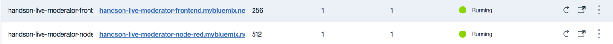


***

## 2.4 Configure the database access

The web application needs access to the Cloudant database.

**Step 1:**

Create an api user inside the cloudant database to provide access to for the WebApplication.

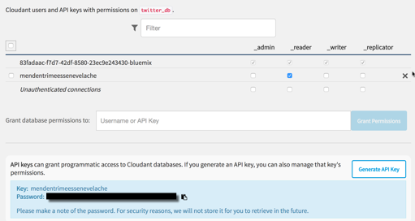

**Step 2:**

Now open file and configure the database access **./public/js/app.js**.

**[YOUR_CLOUDANT_USER]**; **[YOUR_CLOUDANT_ID]**; **[YOUR_CLOUDANT_PASSWORD]**

```javascript
    // Define all constants.

    app.constant('api', {
        url_database: 'https://[YOUR_CLOUDANT_ID]-bluemix.cloudant.com/twitter_db/',
        user_database: '[YOUR_CLOUDANT_USER]',
        pass_database: '[YOUR_CLOUDANT_PASSWORD]'
    });
```
***

## 2.4 Run the Frontend application

## **Step 1:**

Run the Node.JS application in Bluemix.

* Application before the Push to Bluemix

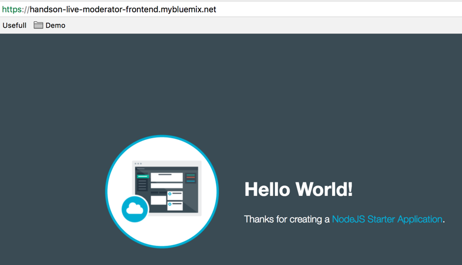

* Log in to your Bluemix account using the Cloud Foundry CLI tool.

	```
	cf login
	```

* Push the app to Bluemix.

	```
	cf push [YOUR_APPLICATION_NAME]
	```

* Application after the Push to Bluemix

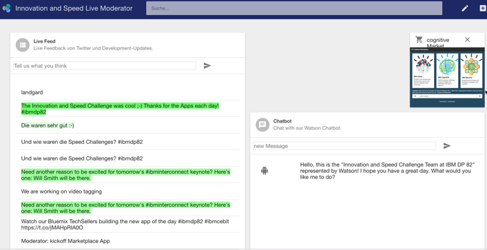

## **Step 2: (optional)**

To run the node application locally, execute following commands

* Install the needed node packages using npm

  ```
  npm install
  ```

* Run the node application on your local machine

  ```
  node app.js
  ```

# 3. Add continuous delivery (devops) to the project

## **Step 1:**

Open you frontend application inside Bluemix.

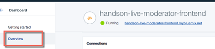


## **Step 2:**

Under **continuous delivery** press **enable**

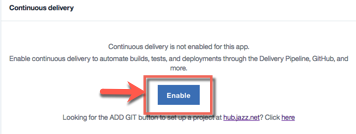

## **Step 3:**

Give your toolchain a name, maybe it looks like this: toolchain-handson-live-moderator-frontend

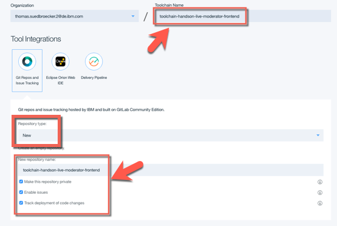

## **Step 4:**

Verify the tools of your toolchain and inspect the github part.


## **Step 5:**

Maybe you will notice you have to add an SSH key to your account.

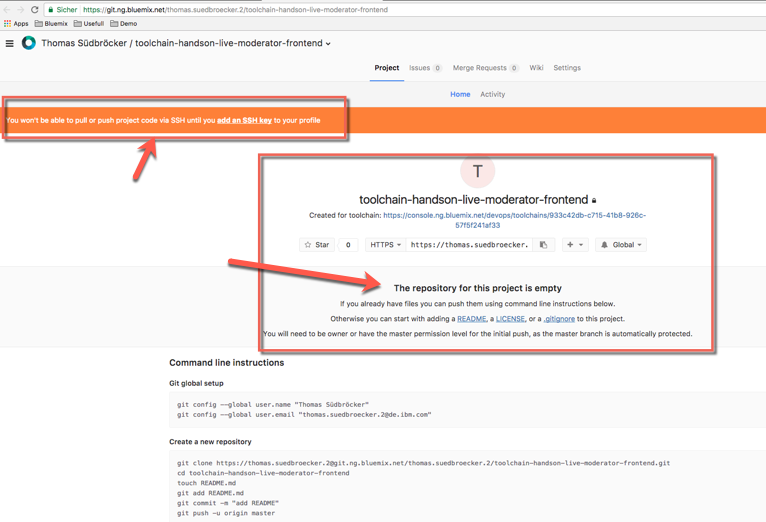

## **Step 6: (optional)**

Follow the steps to create an SSH key

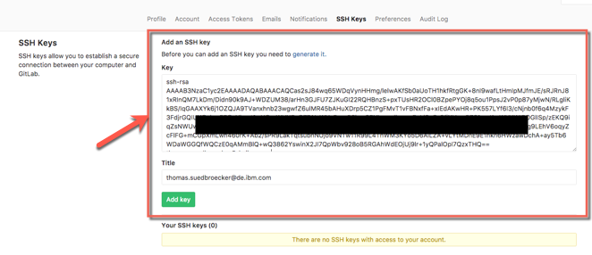

## **Step 7:**

Follow the 2 steps to clone the new git project to your local machine

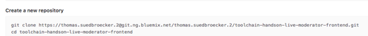

## **Step 8:**

### **Option 1 reuse existing folder on local machine**

Follow the given steps in your new IBM GitLab repository page.

Maybe you need the following command to upload your existing repository to the IBM GitLab.
Not using **add origin**, just use **set-url origin**:

  ```
  git remote set-url origin git@git.YOUR_GIT/YOUR_GIT_REP.git
  ```

  ```
  git push -u origin --all
  ```

### **Option 2 create new folder on local machine**

Copy the content of your **current project** to the new **created project** and push it to the new git project.

* Add the new code to git.
  ```
  git add -A
  ```

* Commit the changes locally
  ```
  git commit -m "add existing code to the new project"
  ```

* Push the changes to the new repository
  ```
  git push -u origin master
  ```


## **Step 9:**

Verify the Delivery Pipeline

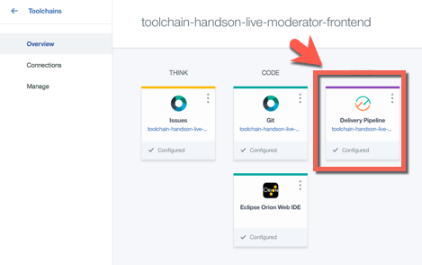

Now you can see the Build Stage and the Deploy Stage

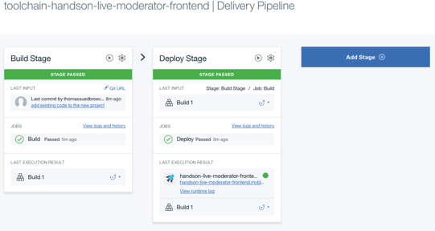
